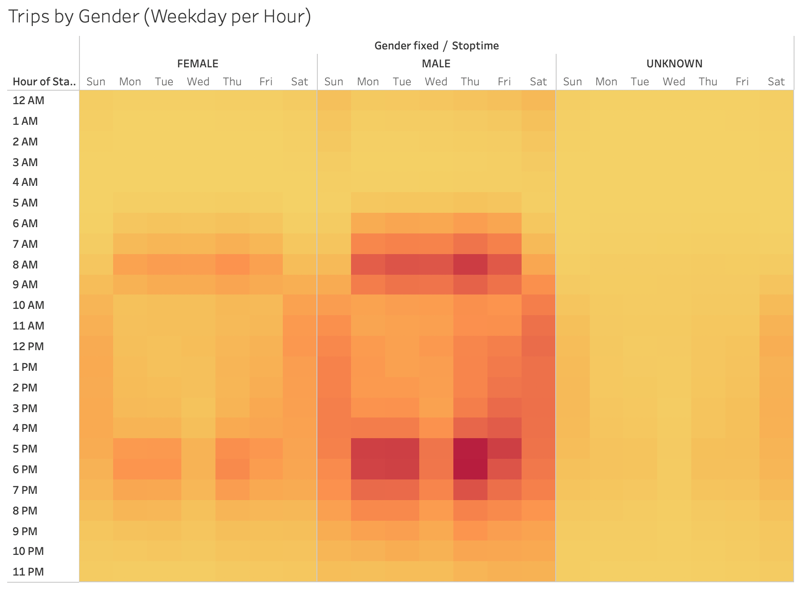

### CitiBike in New York - Analysis for August 2019

[Link to Dashboard](https://public.tableau.com/shared/TBMW5FN32?:display_count=n&:origin=viz_share_link)

## Overview

- The purpose of this analysis is to provide an overview of of New York City's CitiBike bikesharing program, in order to determine its suitability for export to other geos (in particular, Des Moines IA).

## Results

- Our analysis begins with a high-level summary: in August 2019 2.3 million rides were taken using CitiBike, with roughly 80% of those rides being taken by subscription holders (versus non-subscribers)

- Diving deeper, we next want to see when someone checks out a bike, how long they are using it for. Here, we can see the majority of users rent a bike for approximately 7 minutes.

- We can break it down further though to see that men have a slightly shorter trip duration of five minutes, versus women renting for six. This chart makes it clear though that the majority of users are male.

- Let's continue to try to understand usage patterns, here seeing that for both male and female subscribers, there are noticeably less users on Wednesdays.

- We can also look at which times of day are busiest, with weekdays showing peak useage in the mornings and evenings (during regular commuting hours), while weekend useage is more spread throughout the day (with subtle increases in the afternoons).

- Again, we can include gender here as well.

- Finally, let's look at where our bikes are being used. There is a heavy concentration of useage in Manhattan.

## Summary

- Overall, the CitiBike system is a well-used piece of infrastructure that has woven itself into the daily lives of many New Yorkers. However, this does not mean that such a system is suitable for all locations, especially more rural / less dense cities like Des Moines.

- In order to determine whether or not the City of Des Moines, IA should build out a similar system it would be useful to know distances traveled on average rides. While we have times included in this analysis, distances may be more useful in order to determine if a less-dense locale like Des Moines could support Bike Share. In a city like New York, bikes are replacing walking, buses, and the subway. In Des Moines, it would need to replace the car.

- Similarly, it would help to know what percentage of "non-subscribers" are tourists versus locals. This further breakdown would help to determine if a city like Des Moines, with significantly lower numbers of tourists as compared ot New York, could financially support sucha system.
